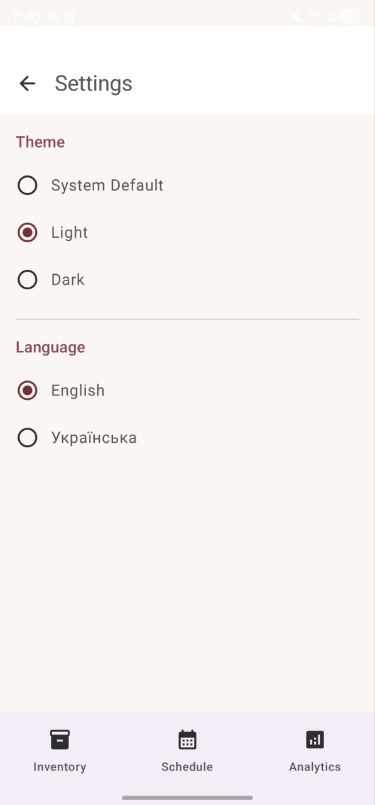
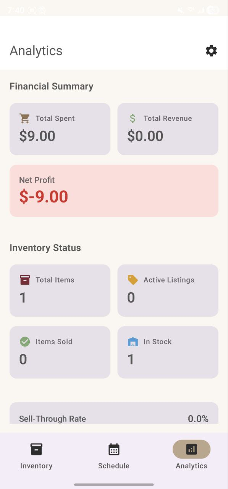
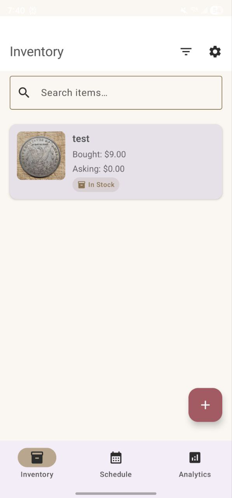
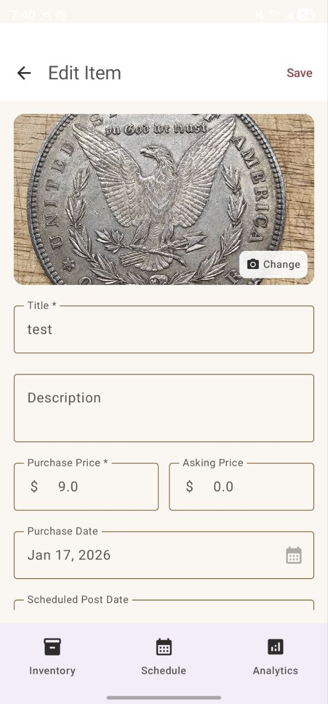
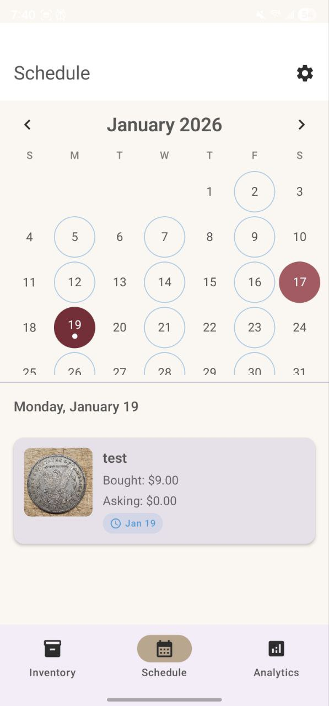

  

<h1 align="center">Dust Gatherer</h1>

  An Android app for tracking resale inventory — from thrift store finds to final sale.

## Features

- **Inventory Management** — Add items with photos, purchase price, asking price, location, and notes
- **Status Tracking** — Track items through their lifecycle: In Stock → Scheduled → Posted → Sold
- **Quick Actions** — Swipe right to mark as posted, swipe left to mark as sold
- **Analytics Dashboard** — View total spent, revenue, and net profit at a glance
- **Search & Filter** — Find items quickly by name or filter by status
- **Dark Mode** — System, light, or dark theme options
- **Bilingual** — English and Ukrainian language support

## Screenshots

  
  
  
  
  

## Tech Stack

- **Language:** Kotlin
- **UI:** Jetpack Compose with Material 3
- **Architecture:** MVVM with ViewModels
- **Database:** Room
- **Preferences:** DataStore
- **Image Loading:** Coil

## Building

1. Clone the repository
2. Open in Android Studio
3. Sync Gradle and run on device/emulator

### Generate APK

**Debug:** Build → Generate App Bundles or APKs → Generate APKs

**Release:** Build → Generate Signed App Bundle or APK

## Requirements

- Android 8.0 (API 26) or higher
- Android Studio Hedgehog or newer

## License

MIT License — see [LICENSE](LICENSE) for details.
